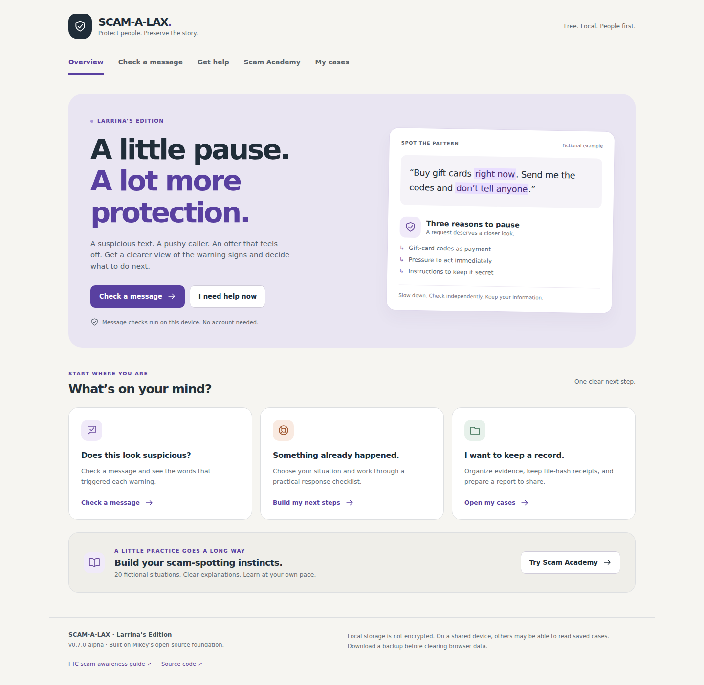

# SCAM-A-LAX

**Larrina’s Edition — Scam Awareness, Support & Evidence**

> Flush scams. Preserve evidence. Map the mess.

SCAM-A-LAX is a free, open-source, local-first toolkit for organizing scam reports, preserving evidence metadata, triaging suspicious messages, mapping identifiers, correlating local cases, and producing clean case packets for victims, banks, platforms, investigators, and law-enforcement handoff.

Current build: **v0.7.0-alpha — Larrina’s Edition**

This fork adds a people-first front door to Mikey’s local evidence workstation. Begin with **Easy Scam Radar**, **Check a message**, **Get help**, or **Scam Academy**; use **My cases** when you want to preserve and export a record. Existing `scamalax.state.v1` case data and evidence semantics are retained.



### New in this edition

- **Easy Scam Radar**: a one-question-at-a-time, large-button warning checklist designed to be approachable for older adults and people helping relatives. Twenty-four plain-language questions cover gift cards and cashier cover stories, refund overpayments, government/sheriff impersonation, military and charity pressure, family emergencies, remote access, banking codes, secrecy, job fees, staying on the phone through a purchase, pressured callbacks, bank cover stories, blocked verification, cash/gold couriers, unexpected sign-in links, online military relationships, recovery fees, and check-return requests. YES adds transparent warning points; NO and NOT SURE add none. The centered needle stays visible on desktop and phone. Zero warnings remain **Unknown · safety unverified**, and the 100-point cap is **not a scam probability**. Answers stay in page memory and never automatically become evidence. A quick callback alone does not prove a scam. Language, accent, and nationality do not contribute points.
- **Call & message log**: open a saved case and keep a separate entry for each call, text, email, chat, or voicemail. Record what was said, how you know, optional contact date/time/time zone, displayed sender and supplied callback number, claimed name, language if known, payment/store details, and what you did next. Review before saving. Contact time stays user supplied; the note’s save time is separate. Optional screenshots keep their original bytes and a linked SHA-256 receipt. Entries are user statements, not verified identities or findings; the app does not record live calls or submit reports. Search, Number Tracker, case packets, handoffs, and workspace backups include them. Use Scam Ledger for linked clarifications that retain the original.
- **Save a new case** guides you through your story, optional incident date/approximate USD loss, optional contact details/attachment, and a review before **Save case**. The case and its first records enter the workspace together, with a lasting saved confirmation and unique ID. A name is optional. The advanced empty-folder action separately explains that it has not saved a story.
- **Find a saved case** searches story words, case names/IDs, record IDs, contact details, and filenames. Filter by status or sort by age/name. A filtered empty list explains that saved cases are unchanged and offers clear filters.
- **Clarifications retain history**: add a correction as a new user statement linked to the original record. Original text, hashes, screenshots, and evidence states stay intact. User statements and incident context are labeled in case reports and handoffs.
- **Draft protection**: guided drafts and selected files stay in tab memory across app navigation and helper use; refresh/close warns before losing them. Leaving an unsaved ledger record, contact note, clarification, or intake asks before discarding it. A cancelled departure retains the draft; an accepted departure discards it. Save failures keep contact text and selected files for retry. Intake and contact saves read the latest workspace and refuse deleted targets.
- **App helper** opens from any page with topic buttons and short questions about saving stories, finding records, backups, reports, file receipts, message checks, and Academy practice. It uses built-in directions, not a remote AI service; no account or API key is needed. Chat stays in tab memory, never becomes case evidence, and clears on refresh. Opening and closing it preserves unsaved forms. Navigation happens only when the user selects a destination button.
- **Number tracker** looks up phone numbers across saved local case records, lists numbers already mentioned, and shows the matching cases and source records with their original evidence labels. It uses the existing conservative phone matching: country-coded and unqualified local formats remain separate. Searching sends no number outside the app and does not modify evidence. No local match is not a safety verdict; public scam databases and caller location are not searched. Select **Open this case** to choose a matching case for review.
- **Saved screenshots**: choose a PNG, JPG, or WebP image up to 10 MB in Scam Ledger and leave **Save a viewable copy with this case** checked. Save record preserves the original image in local IndexedDB, keeps its SHA-256 receipt, and retains the description entered alongside it. Open, enlarge, or download it from the record. Case/workspace JSON exports and JSON handoffs include referenced images as `attachments`; Markdown includes their manifest and receipts. Receipt-only files remain metadata only. Nothing is uploaded. Clearing local case data also clears stored screenshots; browser storage is not encrypted and can be cleared by the browser. Keep originals and a backup.
- **Scam radar**: the same local message rules drive an accessible four-band gauge in Check a message and case-based ScamCheck: Low concern (1–19), Caution (20–44), High concern (45–69), Very high concern (70–100). Points measure configured warning strength, not a probability, verified identity, or amount of harm. No matches show **Unknown · safety unverified**, not a safe verdict. Read matched excerpts, reasons, and next steps; editing text clears the old result. Screenshot text is not read automatically: enter its words and select **Check record text**.
- **Start here** provides five beginner steps for describing an incident, reviewing/saving a case with its story, finding the saved record, making a backup, and preparing a report. A reminder stays available inside My cases. **Save record** adds to an existing case.
- A responsive overview with plain-language navigation and direct help paths.
- Standalone message screening that needs no case. Every matched rule includes the matched words, an explanation, and a next step. No matches leave safety **unverified**. Checks do not open pasted links, save the message, or upload it.
- A situation-based response checklist for payments, exposed accounts, and device access, with deliberate links to official U.S. reporting resources.
- Twenty fictional Scam Academy scenarios across four topics, including expected activity and situations that need independent verification. Each choice gets an explanation; practice progress is saved locally.
- One shared screening engine for standalone checks and case-based ScamCheck. Case analysis continues to be recorded only as `INFERRED`.

Message text in the standalone checker is held only while that page is open. Navigating away discards it; opening My cases does not automatically create evidence. Learning answers, selected help situations, and checklist ticks use the separate `scamalax.learning.v1` key. They contain no pasted messages or case records. Browser storage is not encrypted and is not a shared or cloud backup.

Support and awareness content references FTC consumer guidance, reviewed October 7, 2026:

- [What to do if you were scammed](https://consumer.ftc.gov/articles/what-do-if-you-were-scammed)
- [How to avoid a scam](https://consumer.ftc.gov/articles/how-avoid-scam)
- [Job scams](https://consumer.ftc.gov/articles/job-scams)
- [Refund and recovery scams](https://consumer.ftc.gov/articles/refund-and-recovery-scams)

The Academy examples are original fictional exercises, not real incident reports. This app cannot verify identity, guarantee detection, recover funds, or confirm that an account or device is secure.

## Core principles

- **Defensive only.** No credential theft, malware, unauthorized access, retaliation, doxxing, or destructive tooling.
- **Evidence before inference.** Observations, correlations, and hypotheses remain visibly distinct.
- **Preview before commit.** Bulk intake proposes records first; the analyst chooses what actually enters a case.
- **Local first.** Case data stays in the browser unless the user deliberately exports it.
- **Human authority.** Automated parsing can structure evidence; it cannot declare guilt or silently upgrade evidence state.
- **Derived intelligence has no authority of its own.** Entity extraction and graph edges remain traceable to evidence or explicit analyst hypotheses.
- **Original evidence stays original.** File evidence is hashed in-browser and recorded without altering or uploading the source file.

## Current modules

- **Evidence Intake** — preview-first intake for raw email, transcripts, bulk indicators, screenshots, and other files.
- **Email Header Parser** — preserves selected standard headers, repeated `Received` hops, message IDs, and the raw source for review.
- **Transcript Intake** — separates timestamped/speaker-labeled call or chat transcripts into reviewable records.
- **Batch File Hashing** — stages multiple files or screenshots and creates SHA-256 receipts without storing file bytes.
- **Handoff Profiles** — purpose-built Victim, Bank/Fraud, Platform Abuse, and Law-Enforcement/Investigator exports.
- **Scam Ledger** — case timeline, evidence records, confidence states, SHA-256 receipts.
- **Intelligence Graph** — deterministic local extraction of phones, emails, URLs, domains, IPs, crypto wallets, payment handles, and remote-access IDs.
- **Cross-Case Correlation** — highlights repeated useful identifiers across local cases while suppressing generic service domains.
- **Analyst Links** — explicit, state-labeled hypotheses between extracted entities.
- **ScamCheck** — local heuristic screening for common scam indicators.
- **Victim Rescue** — immediate-response checklist for active scam situations.
- **Case Packet v2** — Markdown and JSON exports containing evidence plus clearly marked non-authoritative derived intelligence.
- **Workspace Backup** — portable JSON backup of local cases.

**Scam Academy** is now available in this edition. **ScamWatch** remains a future module.

## Evidence Intake semantics

Evidence Intake is a staging layer. Pasted material is parsed into **proposed records**, not automatically written to the case. The analyst can include/exclude each record and change its kind or evidence state before committing.

Evidence Intake reads files locally to calculate SHA-256 receipts and keeps metadata only. Scam Ledger additionally offers viewable PNG/JPG/WebP screenshot copies, saved without changing the original bytes. Images are validated and stored locally; failed image or case writes preserve the unsaved form and do not add a false record. SCAM-A-LAX does **not** perform OCR or image interpretation.

Raw email intake preserves the submitted source as the canonical email evidence. Header parsing and body extraction are convenience views over that source and do not increase epistemic authority.

## Handoff profiles

Handoff profiles filter presentation for a particular audience without mutating the underlying case:

- **Victim Copy** — readable evidence/timeline summary for the victim or trusted helper.
- **Bank / Fraud Department** — payment-oriented records and relevant identifiers.
- **Platform Abuse Report** — account/contact/URL/domain/remote-access indicators and source references.
- **Law-Enforcement / Investigator Packet** — full evidence, derived entity index, cross-case correlations, and explicit analyst links.

Every handoff that includes extracted entities labels them **NON_AUTHORITATIVE**. A tailored export is not a verdict, legal filing, or independent verification.

## Evidence states

`OBSERVED` · `SUPPORTED` · `CORRELATED` · `INFERRED` · `DISPUTED` · `UNKNOWN`

These labels are intentionally conservative. A correlation is not proof, an inference is not evidence, and software is not a judge.

## Intelligence semantics

The Intelligence Graph is a **derived view**. Extracted entities are recomputed from case evidence rather than silently becoming new evidence records. Cross-case matches mean only that the same normalized identifier occurs in more than one local case. Analyst-authored links carry an explicit evidence state and remain visibly distinct from extraction edges.

Generic providers such as Gmail, Outlook, Yahoo, iCloud, and similar common domains are suppressed from cross-case matching to reduce meaningless correlations.

## Development

```bash
npm ci
npm test
npm run dev
```

Production build:

```bash
npm run build
npm run preview
```

Desktop/mobile browser QA against the production build:

```bash
npx playwright install chromium
npm run test:browser
```

The browser suite verifies helper navigation, private in-memory questions, keyboard close, unsaved draft preservation, short-viewport access, phone-number matches and country-code separation, source-case opening, unreadable workspace handling, message privacy, result invalidation, checklist and lesson persistence, all 20 practice scenarios, legacy case preservation, exports, preview-before-commit intake, and inferred-only case analysis. It also checks screenshot persistence after refresh, modal focus and Escape, byte-exact image downloads, images in workspace/case/handoff JSON, receipt-only choices, rejected image formats, blocked/full image storage, rollback after a failed case write, image deletion, every radar band, and unknown readings. QA images are written to the ignored `test-results/` folder. For an already-running preview set `QA_BASE_URL`; for a managed Chromium installation set `PLAYWRIGHT_CHROMIUM_EXECUTABLE_PATH`.

## GitHub Pages

The repository includes GitHub Actions workflows for tests/build validation and Vite deployment to GitHub Pages.

In **Settings → Pages → Build and deployment → Source**, choose **GitHub Actions**. The existing workflow publishes compiled `dist`; branch/Jekyll publishing can overwrite it with unbuilt source. Confirm the setting before a production merge. Feature branches do not deploy production.

See the [upgrade audit, validation and real desktop/phone screenshots](docs/UPGRADE_AUDIT.md) and [guided-case release notes](docs/RELEASE_NOTES_guided-cases.md). The guided regression suite is included in the existing browser command and CI, covering review edits, retained draft files, duplicate submits, save/reload/search, filters/sorting, clarifications, exports, storage rollback/retry, newer intake records, and deleted targets.

See the [Easy Scam Radar integration notes and focused checks](docs/RELEASE_NOTES_easy-radar.md) for question scoring, temporary answers, visible desktop/phone meters and compatibility with case drafts.

See the [call/message log release notes and focused rerun checklist](docs/RELEASE_NOTES_contact-log.md) for the 24-question update, source-time and language fields, original-byte receipts, exports, and remaining limits.

## Safety boundary

SCAM-A-LAX is intended for defensive evidence organization, victim support, authorized investigation, and scam-awareness work. Do not use it for unauthorized access, credential collection, malware delivery, retaliation, doxxing, or harassment.

## License

MIT. Build useful things. Protect people. Don't become the problem you're trying to solve.
