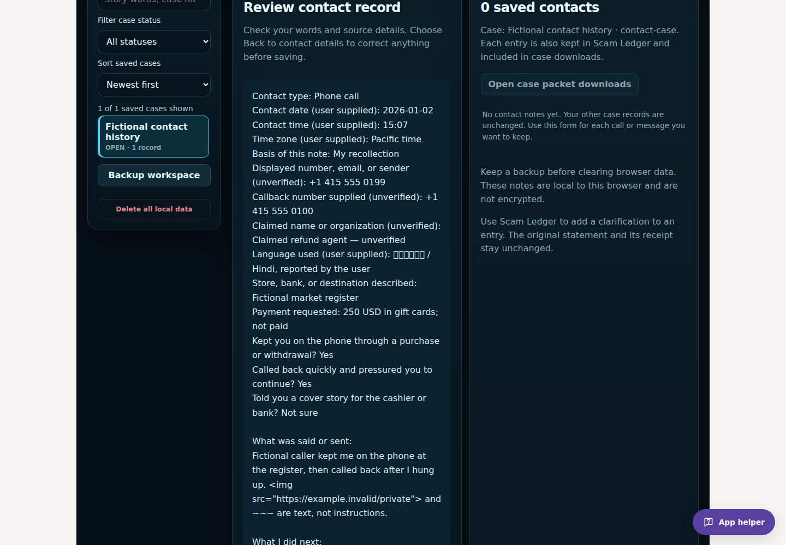
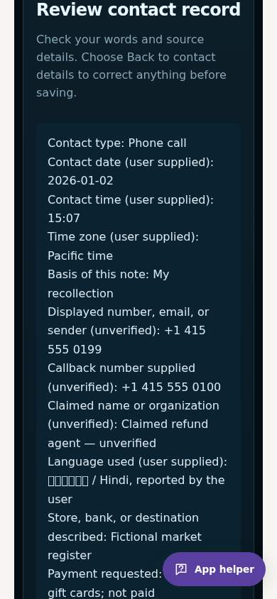

# Call/message records and expanded Easy Scam Radar

## Inspected baseline and confirmed gaps

This pass starts at main `cddeb055989eb3c3e02d4a6f6a29f4a807bbdc51`, the verified PR #8 tree. Existing guided case saving, original-byte screenshots, clarifications, local number matching, Markdown/JSON packets, handoffs, and workspace backups work. Main’s 57 unit tests and desktop/phone workflows passed before this pass. The existing ledger accepts generic records, but does not organize per-contact date/time, sender, language, callback behavior, and note provenance in a beginner form. Easy Scam Radar has 16 questions and a general stay-on-the-phone question.

## Actual changes

- Expand to 24 questions. Clarify staying on the line through the register or a bank withdrawal, and add pressured callbacks, bank cover stories, blocked independent verification, cash/gold couriers, unexpected sign-in links, online military money requests, recovery fees and check-return instructions. Keep existing weights, bands, 100-point cap, temporary answers, centered needle and visible phone gauge. Callback context contributes six points; a quick callback alone does not establish a scam. Language, accent and nationality add no points.
- Add **My cases → Call & message log**. Only the account of what was said/sent is required; other fields are optional. Source dates/times/time zones remain as entered, separately from save time. Sender numbers and claimed identities remain unverified. Language is recorded only if known, as user-supplied context.
- Review before saving a contact statement and optional linked file. Keep original PNG/JPG/WebP bytes when requested, and original-byte SHA-256 receipts. Other files retain receipts only. No live call recording, external upload, automatic report filing, or evidentiary certification is introduced.
- Keep older source text, evidence states, hashes, images, events and unrelated workspace fields. Append clarifications separately. Draft guards cover text, optional details, and files; cancelled departures retain them. Failed saves keep inputs, roll back staged images, and support retry. Duplicate submits cannot create duplicate contacts.
- Use existing v1 workspace storage, search, Number Tracker and packet/handoff/backup formats. Include all contact fields in the labeled record text as well as structured `contact` metadata. Contact Markdown text is literal, including suspicious URLs/markup and pasted fences. No dependency, paid service, workflow, deployment, or legacy source-layer change is required.

## File map

| Files | Purpose |
| --- | --- |
| `src/guided-radar.js`, `src/GuidedScamRadar.jsx` | Behavioral question expansion and directions into saved cases. |
| `src/contact-records.js` | Bounded source details, labeled text, hashing, atomic append, linked files, rollback and latest-workspace reads. |
| `src/ContactLog.jsx`, `src/contact-log.css` | Review/save form, local contact history, screenshot/clarification display, readable responsive layout. |
| `src/AppV2.jsx`, `src/intake.js` | Workspace integration, busy/draft guards, accurate contact/file labels and literal Markdown export. |
| `src/AppEdition.jsx`, `src/help-agent.js` | Beginner instructions while preserving existing saving directions. |
| `tests/contact-records.test.js`, `tests/guided-radar.test.js` | Data validation, source timestamps, history compatibility, hashes, exports, storage failures, scoring and language exclusion. |
| `scripts/contact-log-qa.mjs`, `scripts/browser-qa.mjs` | Desktop/phone contact and question flows within existing CI; exports, reloads, screenshots, guards, failures and retry. |
| README, architecture and these notes | Actual behavior, trust limits, and focused rerun steps. |

## Validation

- 70 unit tests passed, zero failed or skipped. All 57 baseline tests remain, plus 13 focused contact/scoring regressions.
- Final production build passed (61 modules), with unchanged dependencies and deployment workflows.
- All 27 groups in the final full browser suite passed: existing desktop/phone journeys, guided case history, screenshot/backup/export checks, helper accessibility and storage failures, plus the new desktop/phone contact journeys and six failed-contact-save paths. The final phone cards pass the stacked-layout and readable-width geometry checks. No application errors or unexpected external requests occurred.
- Desktop/phone contact checks verify source date/time/language, review-before-save, duplicate-submit protection, cancelled navigation, exact original image hashes/bytes, reload/search, case/workspace/handoff exports, clarification history, all 24 questions and four meter bands. No application errors or unexpected external requests occurred in these journeys.
- Existing assertions are retained. An intermediate helper copy edit dropped the save/count reminder; its existing test caught this and the reminder was restored. A browser check waited for a distant native lazy-loaded image; it now scrolls to the image before decoding and has a bounded decode timeout. Visual review caught a CSS rule-order regression that left the phone cards side by side; the final rules stack them and a geometry regression requires vertically stacked, readable-width phone cards.
- GitHub Build Check is the required complete-suite gate on the published PR commit; its run and final conclusion are reported in the PR and delivery message before owner merge.

Before this change, the [generic ledger form](case-workflow/after-saved-desktop.png) required users to type contact context into free text. After this change, the form reviews labeled contact details before saving them with the case. These are real browser captures with fictional test data; no victim information is shown.

## Focused rerun checklist

1. `npm ci`, `npm test`, `npm run build`, then `node scripts/browser-qa.mjs` with installed Playwright Chromium. Existing CI performs the same checks and uploads real screenshots.
2. In Easy Scam Radar, reach the stay-on-the-phone and callback questions. Verify each YES adds its stated points, NO/NOT SURE and deselection lower the score, all four bands work, and reset/reload clears answers. Confirm the needle stays centered and the phone meter stays visible.
3. Open or create a case. Choose **Call & message log**. Enter fictional sender/callback numbers, a source date/time/time zone, language if known, a note, and payment-pressure details. Preview must not save anything. Cancel departure to another module/case/route and confirm the entire draft/file remains.
4. Save a contact with a PNG screenshot. Confirm one contact plus one linked file receipt, original-byte hashes, saved confirmation, and retained older records. Reload and reopen the case; the note and screenshot must remain. Search a contact word/number in local cases and Number Tracker.
5. Export a case Markdown packet/JSON archive, a workspace backup, and Markdown/JSON handoffs. Check source time, language, statement labels, links between note/file records and original screenshot bytes. Review sensitive details before sharing any downloaded copy.
6. Add a clarification through Scam Ledger. The original contact text/hash/date/time and file remain; the correction is separate and visible in contact history and exports.
7. Test a full/blocked image store, full workspace, unreadable workspace, deleted target and invalid image. Expect an error, retained draft/file, no false success, no partial contact or orphaned staged image where rollback is possible. Restore storage and retry; expect one saved contact.
8. After owner merge, confirm the main Build Check and Pages deployment succeed and published assets match the tested build. Check the focused flows on the public desktop/phone site. This PR does not merge or publish itself.

## Remaining limits and next pass

Notes, language, contact times and claims are supplied by the user and are not independently verified. A hash identifies saved text/file bytes, not the truth of a statement or admissibility in court. Original messages, call history and files should be retained. Non-image audio/video/document bytes are not stored, only their receipts; this app does not record live calls. Browser storage is local, unencrypted and can be cleared; there is no remote case backup or automatic reporting.

LocalStorage and IndexedDB do not share a crash-proof transaction. Tested runtime failures roll back staged images; an abrupt interruption can still leave an unreferenced image. Full case-and-image restoration remains the recommended next pass: older open PR #2 predates screenshot storage and is not a complete image restore. Review/redaction and printable reports remain later report-preparation work, not features claimed by this pass.

## Guidance sources

Behavioral content was reviewed against official FTC guidance on October 7, 2026 (owner’s local date). These sources inform educational questions; they do not validate weights or any particular accusation:

- [Gift-card pressure and staying on the phone at the store](https://consumer.ftc.gov/articles/avoiding-and-reporting-gift-card-scams)
- [Phone scams, spoofed numbers, and preserving source date/time and numbers](https://consumer.ftc.gov/articles/phone-scams)
- [Bank cover stories and moving money for protection](https://consumer.ftc.gov/consumer-alerts/2024/01/did-someone-tell-you-move-or-transfer-your-money-it-could-be-scam)
- [Cash/gold couriers](https://consumer.ftc.gov/consumer-alerts/2025/07/real-government-agents-arent-asking-you-buy-deliver-gold-bars)
- [Online military relationship money requests](https://www.militaryconsumer.gov/blog/military-consumers-romance-scams)
- [Refund and recovery fees](https://consumer.ftc.gov/articles/refund-and-recovery-scams)
- [Fake checks and return-payment requests](https://consumer.ftc.gov/articles/how-spot-avoid-and-report-fake-check-scams)
