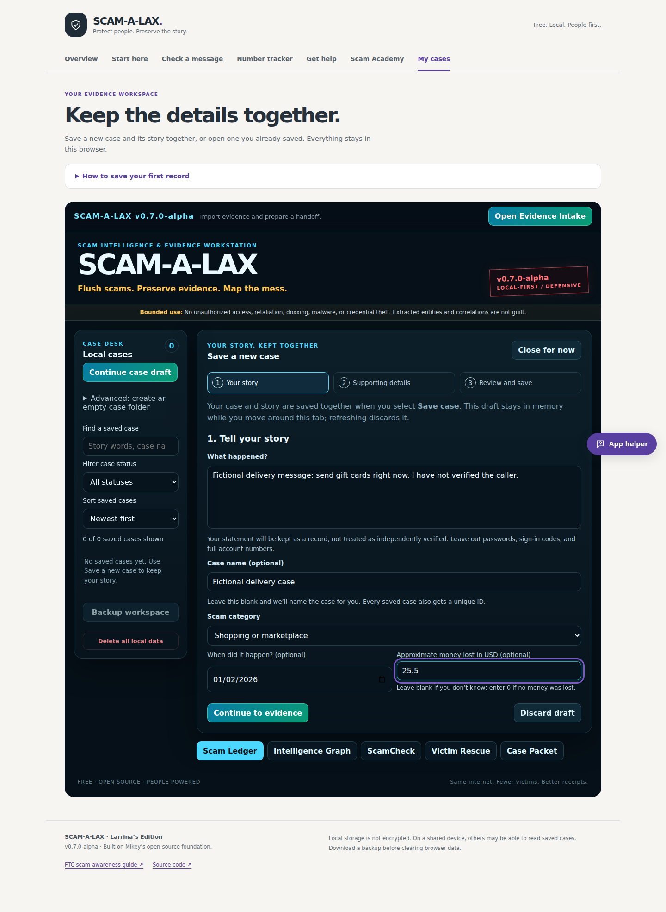

# SCAM-A-LAX upgrade audit and first delivery

Reviewed October 7, 2026 (Pacific), against main `14eb714061fcf3f82c47b590df669d3b63b32be1` after PR #5. This candidate implements the upgrade brief's first case-saving/retrieval priority.

## Audit and baseline

Inspected the active `main.jsx → AppEdition.jsx → AppV3.jsx → AppV2.jsx` path, retained legacy App.jsx, storage/screenshots, screening/radar, helper, tracker, extraction/intake/handoffs, Academy/support, documentation, both workflows, current main runs, merged PRs #1/#3/#4/#5, and open restore PR #2.

The baseline passed 40 unit tests, production build, desktop/mobile browser workflows and existing attachment/storage failure checks. Working features already included local cases/manual record saving, screenshot persistence and original-byte exports, all four radar bands/Unknown state, helper directions, conservative local phone matching, twenty Academy lessons, response checklists, intelligence extraction, preview-first intake, and report/handoff/workspace exports.

No working module was replaced. Existing screening weights, evidence labels, MIT licensing, `scamalax.state.v1`, and deployment workflows are preserved. No paid dependency, remote AI, backend, or public reputation lookup was added.

## Confirmed problems and fixes

| Confirmed behavior | Result |
| --- | --- |
| New case saves a folder with zero records and requires a separate story save. | Guided Save case writes the case and statement together after review. Folder-only creation is explicitly advanced. |
| The creation notice disappears after 3.4 seconds. | Guided save has a lasting confirmation, visible case ID and saved record. |
| The case list lacks story search, status filters and sorting. | Added local search, filtering, sorting and a clear-filters action; no-match copy preserves uncertainty and existing data. |
| There is no clear way to correct a story without replacing its history. | Clarification appends a linked user statement; original text/hash/state/image stay intact. |
| Navigation can discard unfinished forms. | Guided drafts/files survive app navigation; other record/clarification/intake drafts ask before leaving. Refresh/close warns. |
| Advanced intake writes its mounted snapshot, potentially overwriting newer records or another case. | Commit reads fresh storage and updates the current target; deleted targets are refused. |
| Intake write failures are uncaught and give no retry guidance. | Alerts retain preview, text and files; retry is tested. |
| Corrupt containers can appear as empty cases. | Both case surfaces show errors; writers refuse unreadable containers without replacing saved data. This protects data rather than automatically repairing it. |
| Architecture says original images are never stored. | Documentation now explains optional IndexedDB copies and actual attachment exports. |
| The brief assumes backup restoration is already on main. | PR #2 is still open, based on older main, with no IndexedDB attachment restoration. Complete restore remains a follow-on task. |
| Last main merge ran both Vite and dynamic branch/Jekyll deployment. | Documented GitHub Actions publishing Source; repository settings were not changed in this candidate. |

## Changed files and working capabilities

| Files/modules | Change |
| --- | --- |
| `src/NewCaseForm.jsx`, `src/case-workflow.js`, `src/case-guide.css` | Story/details/review flow, validation, optional files, one-write case/records, search/sort, linked clarifications, mobile layout. |
| `src/AppEdition.jsx` | Owns in-memory guided drafts, updates guide/reminder, protects route changes/refresh and busy saves. |
| `src/AppV2.jsx` | Guided entry, explicit empty folder, saved confirmation/ID, retrieval, clarifications, draft guards and incident-aware case exports. |
| `src/AppV3.jsx`, `src/workspace-storage.js` | Fresh writes, malformed-container refusal, intake retry/errors, deleted-target protection and draft guards. |
| `src/HelpAgent.jsx`, `src/help-agent.js` | Accurate new/existing-case directions and navigation during saves. |
| `src/intake.js` | Incident context and statement/clarification labels in handoffs; profile authority remains unchanged. |
| `tests/case-workflow.test.js`, helper/storage tests | Input/date/decimal semantics, history preservation, retrieval, failure protection and handoff context. |
| `scripts/guided-case-qa.mjs`, `scripts/browser-qa.mjs` | New end-to-end cases integrated into existing CI; original checks retained. |
| README, architecture, release notes, audit and images | Actual behavior, limitations, deployment instructions and visual review evidence. |

## Validation

| Check | Result |
| --- | --- |
| Baseline unit tests/build/browser QA | 40 passed; build and browser flows passed |
| Candidate unit tests | 52 passed, 0 failed |
| Candidate Vite build | Passed |
| Existing desktop/mobile workflows | Passed: all twenty lessons, phone tracker, helper, screenshots/exports, radar bands/Unknown and legacy cases |
| Guided desktop/mobile | Passed: required story, optional fields, review edits, retained draft files/navigation/helper, duplicate-submit guard, save/reload, search/filter/sort, clarification, accurate report/handoff/backup |
| Failed guided saves | Passed: full workspace, full/blocked image store, invalid image, unreadable workspace; no partial case/false success, drafts retained, image rollback/retry |
| Advanced intake regressions | Passed: newer record/case retention, full-storage retry, deleted target refused |
| Asserted browser application errors/external requests | 0 / 0 |
| Whitespace check | `git diff --check` passed |

The first extended browser attempt hit an exact-label test selector after a controlled textarea acquired text. It was corrected to the established intake selector; application checks were not weakened. Subsequent full runs passed. All test stories, identifiers and markup samples are fictional.

## Real before/after screenshots

Before: unchanged main's production build, with a folder created and a typed but unsaved story showing zero records. After: this candidate's real automated browser flow. These are Chromium captures, not generated mockups.

| View | Before | Guided story entry | Saved case/records |
| --- | --- | --- | --- |
| Desktop | [Empty-folder flow](case-workflow/before-desktop.png) | [Entry](case-workflow/after-story-desktop.png) | [Saved](case-workflow/after-saved-desktop.png) |
| Phone | [Empty-folder flow](case-workflow/before-mobile.png) | [Entry](case-workflow/after-story-mobile.png) | [Saved](case-workflow/after-saved-mobile.png) |

Build Check also uploads the full `test-results` gallery for helper, Academy, radar, image viewer and historical workflows.

## Limits and next phase

- Browser storage is local and unencrypted. Backups/reports contain supplied private information and need review before sharing.
- Guided drafts are tab memory; a confirmed refresh/close discards them. Successfully saved cases/records persist.
- localStorage and IndexedDB do not share a crash-proof transaction. Runtime image rollback is tested, but interruption can leave an unreferenced copy. Keep originals and JSON backups.
- Full case-and-image restore, unreadable-data repair, redaction/PDF UI, OCR, broader identifier checks and new education are not completed here. No restore button or remote reputation capability is claimed.
- Radar is warning strength, not fraud probability/safety; identifier matches do not prove identity. Helper directions and existing response content are preserved, not presented as a new AI or emergency-guidance expansion.

This branch is for review: no merge, auto-merge or production publish. Confirm **Settings → Pages → Source: GitHub Actions** before approving a merge; branch/Jekyll publishing must not overwrite compiled `dist`.

Next proposed pass: reconcile PR #2 with current shared storage and add validated image-inclusive restoration, preview, duplicate/conflict handling and no-loss cancellation/rollback. Then unify the beginner dashboard/mobile navigation. Larger radar/identifier/support/report/education changes should each have their own approved pass.

Focused rerun checklist:

1. Save a story with no case name and unknown loss; confirm one record after refresh.
2. Save screenshot/contact details with explicitly zero loss; inspect image, count and JSON attachment.
3. Search by story, ID and filename; check no match, filters, clearing filters and sorting.
4. Add a clarification; verify unchanged original text/hash/state/image and the exported source link.
5. Dismiss navigation/discard with an unsaved record; verify the form stays. Check guided-draft retention through helper/pages.
6. Run `npm test` and `npm run test:browser`; review phone/desktop screenshots and CI results.
7. After the owner's merge approval, verify compiled Pages publishing and smoke-test the live case/screenshot/radar paths.
